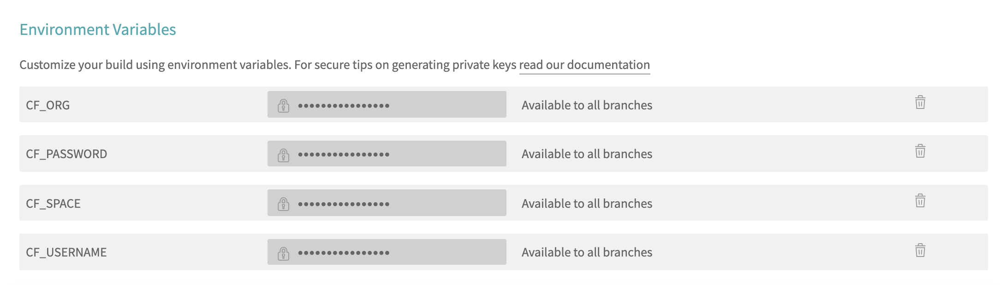

# CI Triggered Task

An example showing how to run a [Cloud Foundry Task](https://docs.cloudfoundry.org/devguide/using-tasks.html) using Travis CI. 

## Contents

* `.travis.yml` - the Travis config file that builds and runs a Docker image to run the task
* `Dockerfile` - used to create the image that has `cf cli` tools to run the task
* `entrypoint.sh` - script that authenticates with cloud.gov and runs the task
* `index.js` and `package.json` - these are just dummy app files that are used to kick off a build in Travis CI. They are deliberately simple and bare-bones.

## Usage

First, set up a cloud.gov [service account](https://cloud.gov/docs/services/cloud-gov-service-account/) and generate credentials.

Store the values for `CF_USERNAME`, `CF_PASSWORD` (which are generated in the previous step), `CF_ORG`, and `CF_SPACE` as environmental variables in Travis.

The `docker run` command [in the `.travis.yml` file](https://github.com/mheadd/task-tests/blob/master/.travis.yml#L8) passes variables to the `entrypoint.sh` file in the Docker container. Change the placeholders with the following values:

* `your-app-name` - the app that you want to run a task on (note, this can be any app in your org/space)
* `your-task` - the task you want to run
* `your-task-name` - the name of the task

The task you run could be a command (e.g., "rails app:sessions:sweep"), or you could invoke a script (e.g., "./my-task.sh") that has been deployed as part of the app you want to run the task on. The choice is yours.

To set your task to run at specified intervals, you can use the [cron feature of Travis](https://docs.travis-ci.com/user/cron-jobs/).
